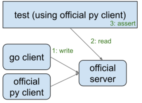

# Conformance tests

Tests the implementation in this repo against the official MLFlow python client and server.

Each box in the figure below is a separate process. The files [Python](main.py) and
[Go](main.go) clients use their respective client libraries to log things, and the test
uses the official python client library to read the things they logged and asserts on them.

Because of the multi-language nature of this test, it can only be run by `bazel test`, not
`go test`.

## Code coverage

This doesn't show up in code coverage reports produced by `bazel coverage` yet.
Maybe once https://github.com/bazelbuild/rules_go/issues/3513 is fixed it will
be possible.
